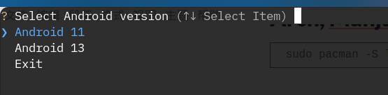
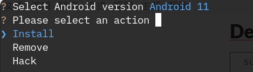
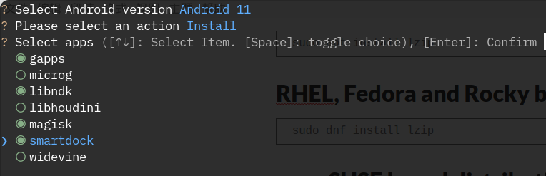
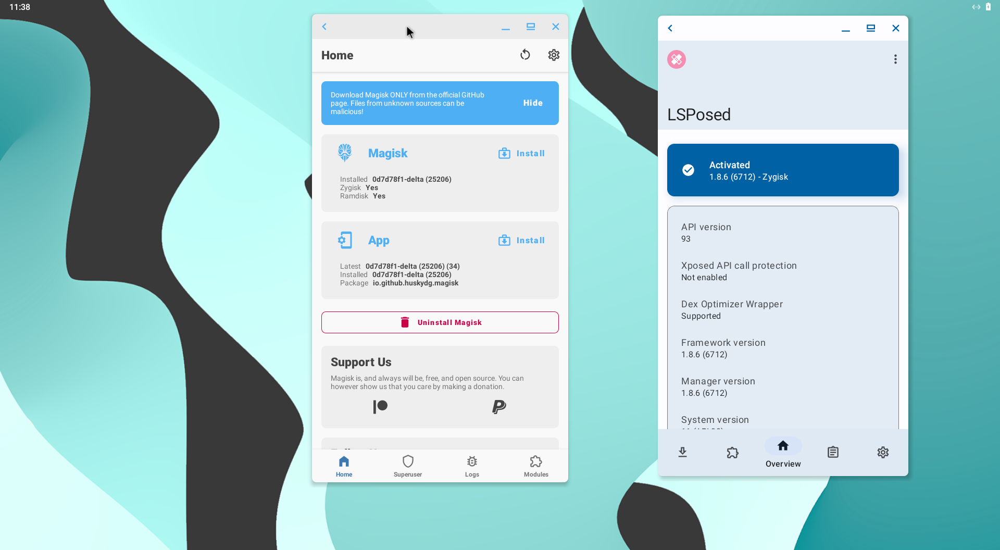
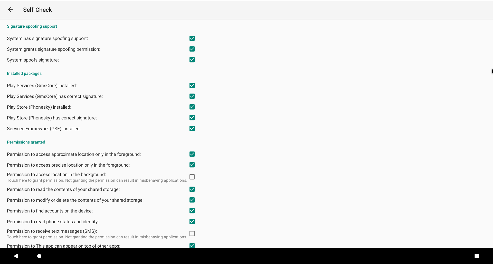
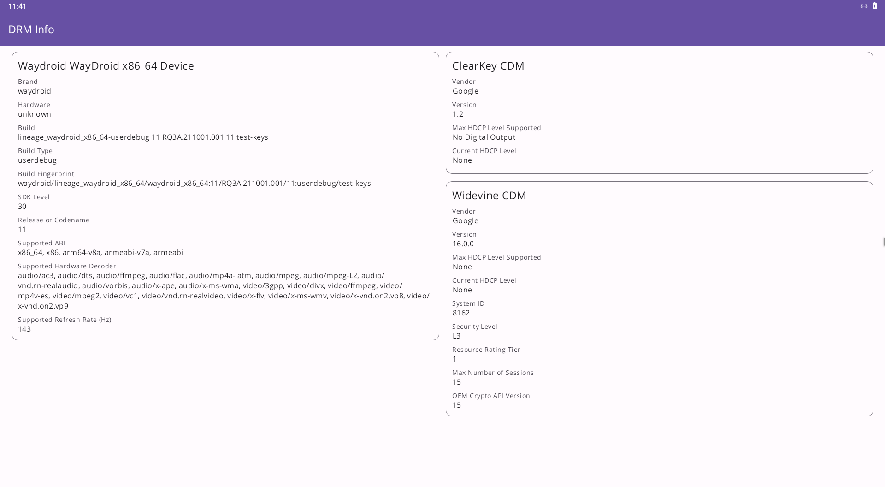

# About

This project contains script to integrate OpenGApps, Magisk, libhoudini, libndk translation libraries and other goodies (e.g smartdock, widevine, hidden status bar, full permission to app data) into Waydroid to enable advanced Android app support and system modifications.

## Dependencies

**[lzip](https://www.nongnu.org/lzip/)** is required for the script to function properly. Install it using your distribution's package manager.

## Usage

### Interactive Terminal Interface

Run the main script to launch the interactive terminal interface, which appears as follows:

  
  


### Command-Line Usage

#### Nix/NixOS

A Nix flake is present in the repository. Simply run:

```bash
nix run github:Tanvir1337x/waydroid_tweaks
```

#### Packages

Available packages: **gapps**, **magisk**, **libndk**, **libhoudini**, **nodataperm**, **smartdock**, **microg**, and **mitm**.

To install a package:

```bash
sudo python3 main.py install <pkg>
```

To uninstall a package:

```bash
sudo python3 main.py uninstall <pkg>
```

#### Android Device ID for Device Registration

You must register your device to use Google Apps. The following command displays your Android ID, which is required for device registration:

```bash
sudo python3 main.py certified
```

See this section: [#opengapps](#opengapps)

#### Hacks

Available hacks: **nodataperm** and **hidestatusbar**.

To install a hack:

```bash
sudo python3 main.py hack <hack>
```

## Install Packages

### OpenGApps


To install OpenGApps:

```bash
sudo python3 main.py install gapps
```

Then, launch Waydroid:

```bash
waydroid show-full-ui
```

After Waydroid has finished booting, run:

```bash
sudo python3 main.py certified
```

Copy the returned numeric ID, visit [this link](https://google.com/android/uncertified/?pli=1), enter the ID, and register it. Wait approximately 30 minutes for the device to get registered, then clear the Google Play Services cache and try logging in.

### Magisk



> **Note:** This script only focuses on Magisk installation. For advanced management or issues like `Magisk installed: N/A`, refer to [waydroid-magisk](https://github.com/nitanmarcel/waydroid-magisk).

To install Magisk:

```bash
sudo python3 main.py install magisk
```

Magisk will be installed on the next boot.  
Zygisk and modules like LSPosed should work.  
To update Magisk, use the **Direct Install into system partition** option or rerun the script.

### microG, Aurora Store, and Aurora Droid



To install microG:

```bash
sudo python main.py install microg
```

### libndk ARM Translation

libndk_translation from Guybrush firmware.  

> **Note:** libndk typically outperforms libhoudini on AMD.

To install libndk:

```bash
sudo python3 main.py install libndk
```

### libhoudini ARM Translation

Intel's libhoudini for Intel/AMD x86 CPUs, sourced from Microsoft's WSA 11 image.  

> **Caution:** libhoudini often underperforms compared to libndk on AMD.

- **houdini version:** 11.0.1b_y.38765.m  
- **houdini64 version:** 11.0.1b_z.38765.m  

To install libhoudini:

```bash
sudo python3 main.py install libhoudini
```

### Widevine DRM (L3)



To install Widevine:

```bash
sudo python3 main.py install widevine
```

### Smart Dock

  


To install Smart Dock:

```bash
sudo python3 main.py install smartdock
```

## Install Hacks

### Grant Full Permission to App Data

This hack temporarily addresses app permission issues on Android 11 by enabling the **persist.sys.nodataperm** property to execute a script that grants full permissions (`777`) to app data.  
For a more robust solution, consider using `sdcardfs` or `esdfs`, which requires recompiling the kernel or WayDroid image.


To grant full permission to app data:

```bash
sudo python3 main.py hack nodataperm
```

> **Note:** Tested on **`lineage-18.1-20230128-VANILLA-waydroid_x86_64.img`**.  

> **Warning:** The script replaces `/system/framework/service.jar`, which may prevent WayDroid from booting.  
If this occurs, uninstall the hack:

```bash
sudo python3 main.py uninstall nodataperm
```

Alternatively, execute the following commands in `sudo waydroid shell`:

```bash
chmod 777 -R /sdcard/Android
chmod 777 -R /data/media/0/Android 
chmod 777 -R /sdcard/Android/data
chmod 777 -R /data/media/0/Android/obb 
chmod 777 -R /mnt/*/*/*/*/Android/data
chmod 777 -R /mnt/*/*/*/*/Android/obb
```

Re-run the commands after installing new apps as needed.

### Hide Status Bar

**Before:**  
  

**After:**  


To hide the status bar:

```bash
sudo python3 main.py hack hidestatusbar
```

## Self-Signed CA Certificate

To install a self-signed CA certificate:

```bash
sudo python3 main.py install mitm --ca-cert mycert.pem
```
